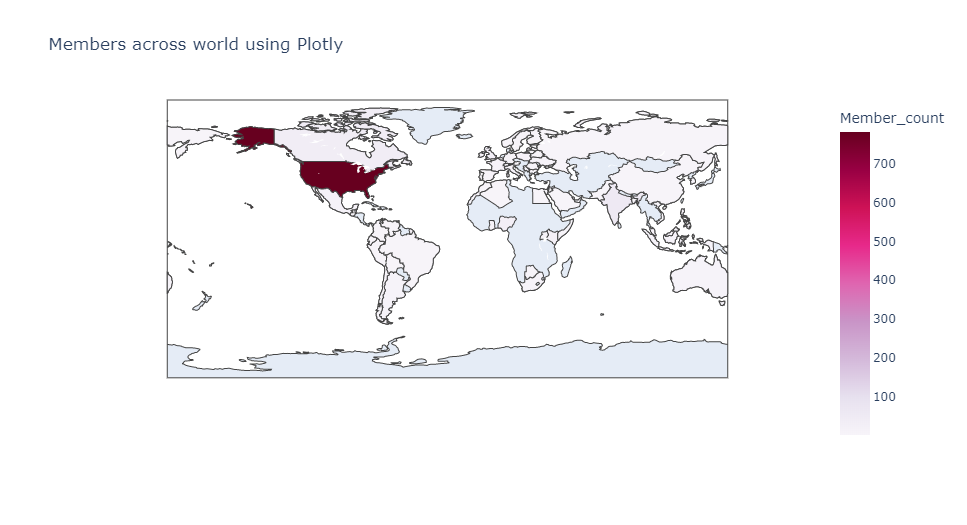
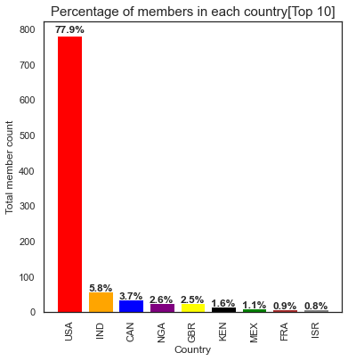
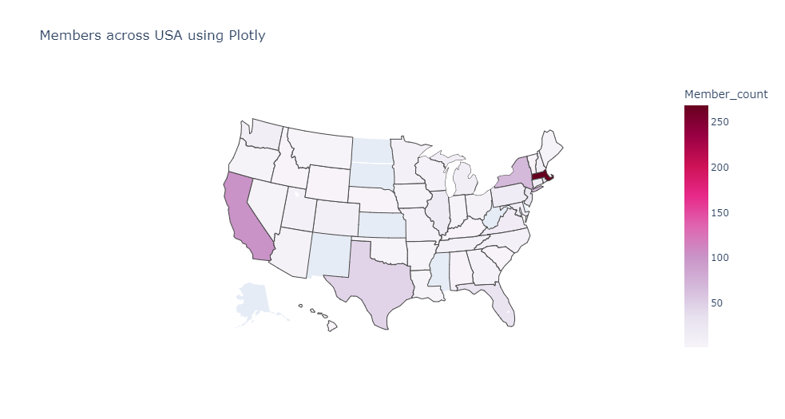
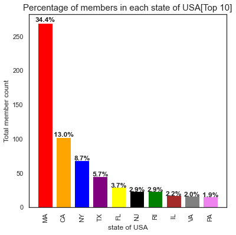
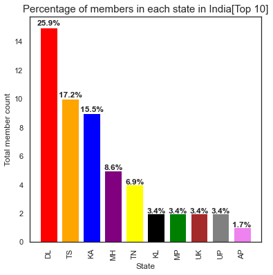
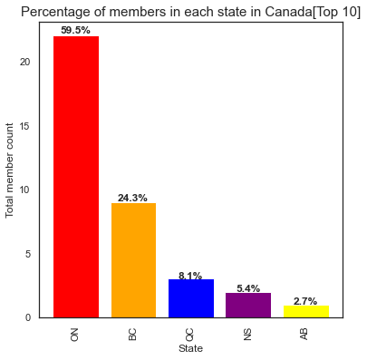
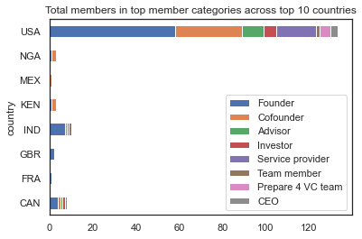
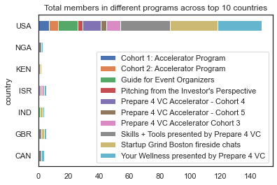

# prepare4vc
<b> by Revathy Thiyagarajan  

Prepare 4 VC built by serial entrepreneurs, investors and venture capital experts to help early stage entrepreneurs navigate the 
most difficult period of their startup lifecycle through community, cohort based and individual programming.
Over a thousand entrepeneurs from different startups around the world have joined their community platform.
This project is geared towards analyzing Prepare 4 VC's community (network) and memberships.

   

# Goals
1.Visualization of categories to showcase potential members the makeup of current members of the community.  
2.Analyze where the members are coming from , visualization using a map, heatmap, etc. of where the membership is.
  
*** 
## Resources  
1.Data Source  : Company real time data   
2.Data analysis : Pandas, Numpy   
3.Matplotlib,Pyplot,Seaborn   
  
***
# Exploratory Data Analysis.  

## 1.Visualization of categories to showcase potential members the makeup of current members of the community.  
 
<b>New members joining each month.    
  
<b>Members leaving the community  
  
***Conclusion***  
- Around 55-60% of the members don’t visit back after their first month.  
- Aug2021 has significantly lower number (28%) which is noteworthy.
- We also see that there is continuous access till 12 months for the same cohort members.
- 80% members of Jun2021 cohort didn’t return yet back for the past 6months.
- None of the members who joined in Sep2021 returned back in October. 
- Few members of Oct2020 cohort are seen after 20+months that comprises of members in host,moderator role

## Effectiveness of referral program  
### Active months  
   
- Members in general are active for 2.5 to 3 months on an average.
- Average inactive period is more (13 months) compared to active one.
- Referred members show more inactive months comparitively

### Program Memberships
  

### Group Memberships
  
We don’t see any significant difference with members who were referred irrespective of whatever area you look into - program, groups, join date, active months.  

## 2.Analyze where the members are coming from , visualization using a map, heatmap, etc. of where the membership is.  

### Members across the world  
<table>
<tr>
<td> </td>
<td> </td>
</tr>
<tr>
<td></td>
<td> </td>
</tr>
<tr>
<td></td>
<td> </td>
</tr>
 <tr>
<td></td>
<td> </td>
</tr>
</table>

# Final Conclusion.   
* Referred members don’t bring in any significant improvement.
* New members joining is in its lowest(10 - 20) since Apr2022.
* Members who are less active (0-4 months) is higher since Jun2022.
* Members from Asian(except India) and European communities which have high startup community are very low .

